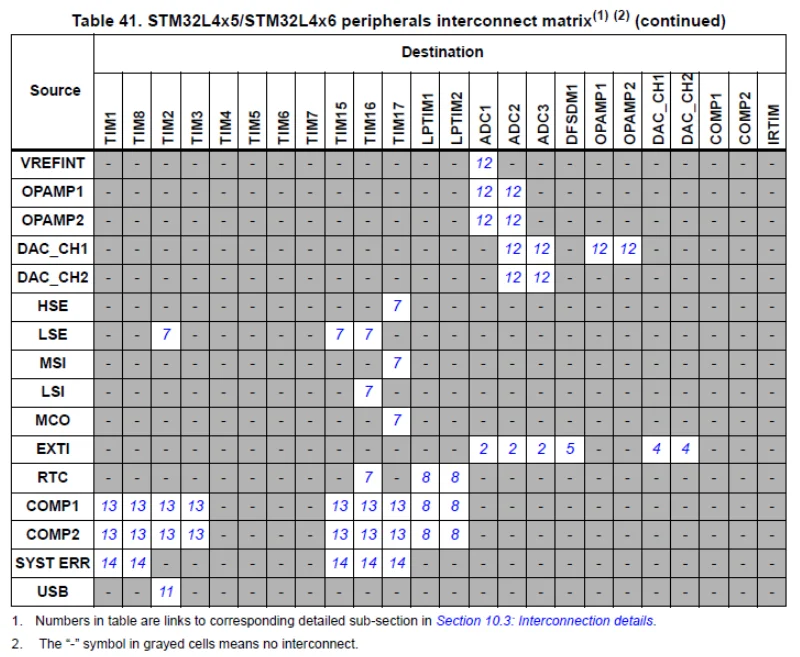
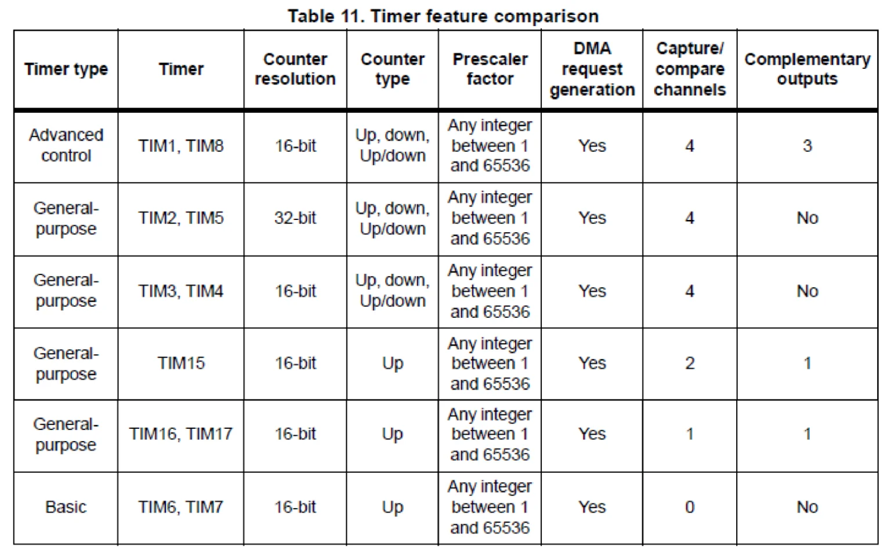
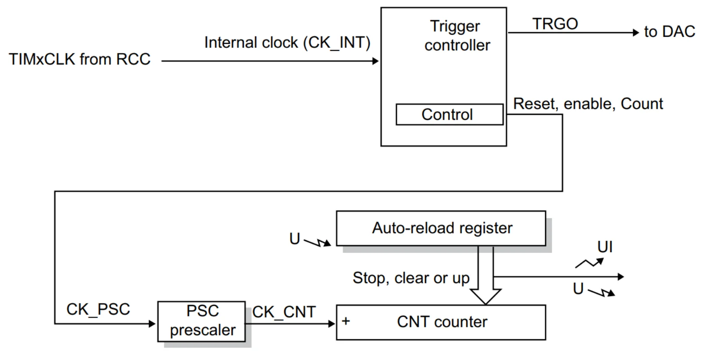
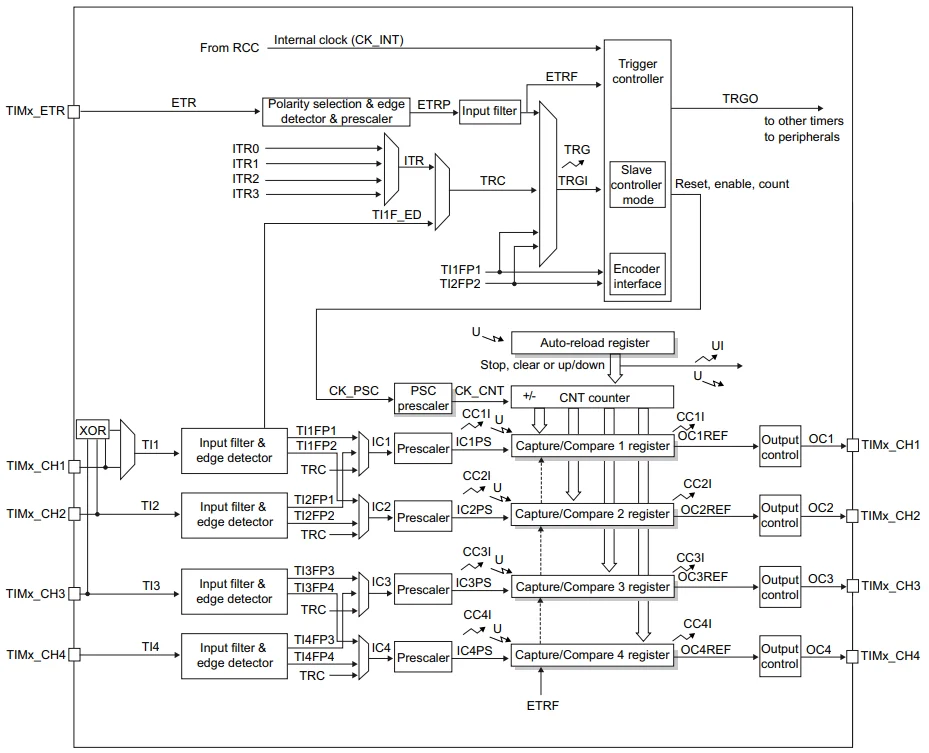
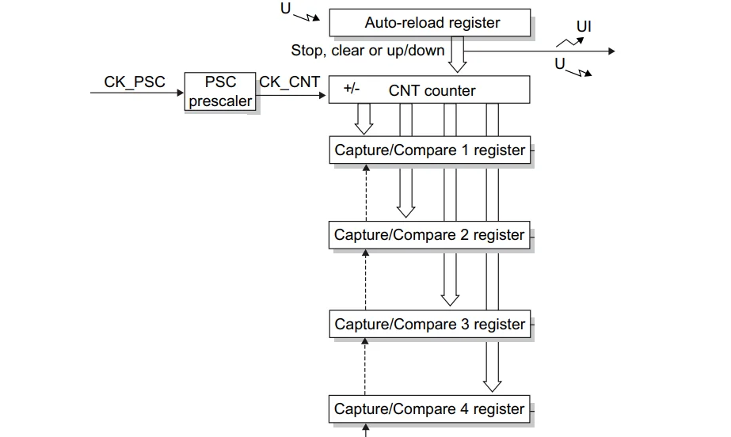

# STM32L476RG_Basics
Repository dedicated to the STM32L476RG microcontainer

#  Table of contents and projects
1. First project
2. GPIO
3. UART
4. System clocking, RTC, watchdog


#  First projects
  - Quick conclusions
    - Device Spec: 
      - Cortex-A – microprocessors, intended mainly for operating systems, e.g. Linux, Android, Windows CE, iOS. They require external systems to work.
      - Cortex-R – circuits intended for real-time systems.
      - Cortex-M – microcontrollers, i.e. systems that have integrated memory and peripheral systems.
      - 3 × SPI, 1 × QSPI, 3 × I2C, 1 × CAN, 5 × USART, 1 × ULP UART,
      - 16 timers,
      - 3 × 12-bits ADC (24 internal canals ADC),
      - 51 × GPIO,
      - 2 × analog comparators,
      - 2 × operational amplifiers,
      - 1 × NTC,
      - DMA (direct memory access),
      - TRNG (true random number generator),
      - FPU (floating-point unit),
      - 1Mb Flash
      - 128 Kb RAM (96 Kb RAM & 32 Kb RAM2.)
    - Code only between `/* USER CODE BEGIN 1 */` & `/* USER CODE END 1 */` -CubeMX overwrites other code when changing configurartion
  #  GPIO
  - Functions
    - `void HAL_GPIO_TogglePin(GPIO_TypeDef* GPIOx, uint16_t GPIO_Pin)` -switching pin state to oposite
    - `void HAL_Delay(uint32_t Delay)`
    - `GPIO_PinState HAL_GPIO_ReadPin(GPIO_TypeDef* GPIOx, uint16_t GPIO_Pin)`  -name of values passing to this function is
                    NAMEFROMCYBEMX_GPIO_Port, NAMEFROMCYBEMX_Pin
    - `void HAL_GPIO_WritePin(GPIO_TypeDef* GPIOx, uint16_t GPIO_Pin, GPIO_PinState PinState)`
  - Quick conclusions
    - pins for same port (for example PB5-PB14) differ from each other by only one bit so we can use (ONLY IN THIS SPECIFIC CASE) bit switch operation << >>
    - when pins are from diferent ports you can use struct:
   ` typedef struct {`
	 ` GPIO_TypeDef* port;`
	  `uint16_t pin;`
    `}led_struct;`
    `led_struct LED[] = {`
		`{LED_1_GPIO_Port,LED_1_Pin},`
		`{LED_2_GPIO_Port,LED_2_Pin},`
    - nice syntax 
    `void led_switch(int led, bool turn)
    {   
	GPIO_PinState state = (turn) ? GPIO_PIN_SET :GPIO_PIN_RESET;
	if (led >= 0 && led < 9)
		HAL_GPIO_WritePin(LED[led].port, LED[led].pin, state);}`
    - Use CubeMx to assign and name pins(better code understunding and automatic code generation)
    - You can turn on Pull up/Pull down in most od pins
  #  UART
  - functions
    - `HAL_StatusTypeDef HAL_UART_Transmit(UART_HandleTypeDef *huart, uint8_t *pData, uint16_t Size, uint32_t Timeout)` 
    pointer to uart struct, data to send, size, timeout, returns error or ok
    - `HAL_StatusTypeDef HAL_UART_Receive(UART_HandleTypeDef *huart, uint8_t *pData, uint16_t Size, uint32_t Timeout)`
    - `HAL_MAX_DELAY` waits forever
    - `fflush(stdout)` force to print stdout - A pointer to a FILE which refers to the standard output stream, usually a display terminal. it is printed only after \n in default
    - `\r` is used to move the cursor back to the beginning of the line in a terminal or console window.
    - `strcmp` function used to compare two strings.

  - Quick conclusions
    - in cubeMX set debug as serial wire (in SYS) and usually USART2 in connectivity
    - strlen because sizeof counts end of line characters etc.
    - A weak function in C is a function that allows for the possibility of having multiple definitions in a program. 
    `__attribute__((weak)) int _write(int file,....`
    - `#include <>` In this case, the preprocessor searches for the header file in the standard directories specified by the system.
    - `#include ""`In this case, the preprocessor searches for the header file in the same directory as the source file, and then in the standard directories.
    - `' '`The single quotes are used for single character constants. They do not interpret any escape sequences.
    - `" "`The double quotes are used for string literals.They interpret escape sequences like newline, tab, backspace, etc.
    - newlib-nano is a C library for embedded systems, and it provides a minimal set of features from the newlib library. The option Use float with printf allows the library to include the necessary code to support the floating-point formatting in the printf function.
    - when Overrun is enable program will block when to much data is received. When disabled it will just loose some data.
  # System clocking, RTC, watchdog
  - functions
    - RTC_TimeTypeDef
      - .Hours
      - .Minutes
      - .Seconds
      - .TimeFormat - AM/PM etc. 
    - RTC_DateTypeDef
      - .WeekDay - for example `RTC_WEEKDAY_TUESDAY`
      - .Month
      - .Date
      - .Year - only last 2 digits so +2000 in this centry :) 
    - This two functons must be used together (Hazard)
    - `HAL_StatusTypeDef HAL_RTC_GetTime(RTC_HandleTypeDef *hrtc, RTC_TimeTypeDef *sTime, uint32_t Format)`
    current time usually set format as RTC_FORMAT_BIN
    - `HAL_StatusTypeDef HAL_RTC_GetDate(RTC_HandleTypeDef *hrtc, RTC_DateTypeDef *sDate, uint32_t Format)`
    - this function sets time in code new variable RTC_TimeTypeDef neaded 
    - `HAL_StatusTypeDef HAL_RTC_SetTime(RTC_HandleTypeDef *hrtc, RTC_TimeTypeDef *sTime, uint32_t Format)`
    - same function for seting date (in real case)
    - `HAL_RTC_SetDate(&hrtc, &new_date, RTC_FORMAT_BIN);`
    - Watchdog refreshing 
    - `HAL_StatusTypeDef HAL_IWDG_Refresh(IWDG_HandleTypeDef *hiwdg)`
    
  - Quick conclusions
    - LSI (ang. low-speed internal) – internal generator RC low frequency (32 kHz),
    - LSE (ang. low-speed external) – external generator low frequency or quartz resonator, usually 32 768 Hz,
    - HSI (ang. high-speed internal) – internal generator RC high frequency (16 MHz),
    - MSI (ang. multi-speed internal) – internal generator RC with selective frequency (from 100 kHz to 48 MHz),
    - HSE (ang. high-speed external) – external generator high frequency or quartz resonator (usually  8 MHz). 
    - PLL (ang. phase locked loop) - frequency multiplier 
    - the STM32L476RG can be made available with two clock versions:
      - low frequency clocks: LSI or LSE,
      - high frequency clocks: HSI, MSI or HSE.
    - lower frequency -> less powert consumption

    - IWDG independent watchdog - other clock 
    - WWDG - same clock 

    - MSI can be calibrated using LSE (accurity rising from 1% to 0.25%)
  # Energy saving
  - functions
    - `HAL_Delay` is just waiting till reach delay tick number, we can us __WFI for turning it off between ticks (interrupts)
    - `__WFI` assembler macro -Wait For Interrupt (stops program till first interrupt)
    - `void HAL_PWR_EnterSTANDBYMode(void)` - puts microcontroller to standby mode
    - We cannot assume constant power consumption because it varies while the program is running
  - Quick conclusions
    - working time calculation mAh(sorce)/curent(board)=hour count -> if same voltage
    - working voltage range 1.7V - 3.6V (no ldo step etc)
    - Wake Up Counter (Timers-> RTC) setts to 20,479 gives us 10s of delay. The RTC module is clocked at 32,768 Hz. In addition, we have a selected divisor by 16. This means that the clock will run at a frequency of 32768 / 16 = 2048 Hz, (20479 + 1) / 2048 = 10. "+ 1" because the counter counts from zero, so counting 100 pulses would require entering the value 99, etc. then we need activate interrupt in NVIC
    - > [!IMPORTANT] bug in cubeMX must add 
    `   /* USER CODE BEGIN RTC_Init 2 */
    - in tools you can use Power Consumption Calculator.
      - double click on mode table to set duration ( auto refresh must be off!)
  if (HAL_RTCEx_SetWakeUpTimer_IT(&hrtc, 20479, RTC_WAKEUPCLOCK_RTCCLK_DIV16) != HAL_OK)
     {
       Error_Handler();
     }
  /* USER CODE END RTC_Init 2 */`
  #  Interrupts & Error handling
  - functions
    - in CubeMX `GPIO_EXTI13` stands for GPIO external interrupt 13
    - `void HAL_GPIO_EXTI_Callback(uint16_t GPIO_Pin)` - funnction used by interrupt handler
    - `volatile` before variable will force the compiler to always refer to memory when operating on variables.This means that the compiler will disable optimizations for such a variable, such as replacement by a constant or the contents of a register 
    - `HAL_StatusTypeDef HAL_UART_Transmit_IT(UART_HandleTypeDef *huart, uint8_t *pData, uint16_t Size)` similar to normal transmit but from interrupt 
    - `void HAL_UART_TxCpltCallback(UART_HandleTypeDef *huart)`function called after last bit was send 
    - `HAL_StatusTypeDef HAL_UART_Receive_IT(UART_HandleTypeDef *huart, uint8_t *pData, uint16_t Size)` data receive using interrupt NO time out so we need to !!
    - `void HAL_UART_RxCpltCallback(UART_HandleTypeDef *huart)`function called after UART receive interrupt is called. Only 1 bit is received so we need to call `HAL_UART_Receive_IT ` -> to start waiting for next bit and function which will handle end of line, enter buffer adding etc example ->
      ```
      static char line_buffer[LINE_MAX_LENGTH + 1];
      static uint32_t line_length;
      void line_append(uint8_t value)
      {
        if (value == '\r' || value == '\n') 
        {
        // End of line 
          if (line_length > 0) 
          {
            // if not NULL -> add end of line 
            line_buffer[line_length] = '\0';
            // data handling 
            if (strcmp(line_buffer, "on") == 0) 
            {
              HAL_GPIO_WritePin(LD2_GPIO_Port, LD2_Pin, GPIO_PIN_SET);
            }
            else if (strcmp(line_buffer, "off") == 0) 
            {
            HAL_GPIO_WritePin(LD2_GPIO_Port, LD2_Pin, GPIO_PIN_RESET);
            }
            //start new text 
            line_length = 0;
          }
        }
        else 
        {
          if (line_length >= LINE_MAX_LENGTH) 
          {
            // to much data 
            line_length = 0;
          }
        // add tu buffer
        line_buffer[line_length++] = value;
        }
      }

    - `HAL_GetTick` miliseconds counnt since program started 
  - Quick conclusions
    - `Static` means maintaining values ​​between successive definitions of the same variable. This is primarily useful in functions. When we define a variable in the function body, this variable will be redefined along with the default value (if any).
    - An example of using `static` is to use it with variables during interrupts because regular variables free up memory space for other variables and the interrupt may occur after the replacement. the static prefix ensures that no variable overwrites this memory location
    - From the programming side, the interrupt handling vector takes the form of an array of pointers to functions, and the functions themselves are the most ordinary functions of the C language. This array is located in the file startup_stm32l476rgtx.s, which can be found in Core\Startup. it was written in assembly language. We simply see an array called g_pfnVectors, the subsequent positions of which (apart from the first one) are the names of the functions called when the interrupt occurs.
    - NVIC "nested vectored interrupt controller" is a universal interrupt controller that is available with ARM Cortex-M cores. This is an advanced solution that has many advantages over the previous ones
    - (External Interrupt Mode) (External Event Mode). The difference is that when an interrupt is reported, its handler is executed. However, the event can be associated with another hardware module and appropriate action will be taken without interrupting the program.
    
    
    - This table shows which modules can be a source and which can be a destination. The button is connected to EXTI, and such a source can be associated with ADC, DFSDM and DAC. This means that pressing the button can, for example, trigger reading from the ADC (after completion, we will receive an interrupt). Without events, we would have two interrupts - the first one from EXTI, which would start the conversion, and only the second one would read the result. Using events has several advantages:
      - fewer interrupts, so the microcontroller has more time for other tasks,
      - if the processor is asleep, events can be handled without waking it up,
      - events run in hardware, so delays are minimal and precisely defined. It doesn't matter for the button, but if it was a signal from a sensor saying that you need to immediately download data from the ADC, in extreme situations the use of interrupts could be too slow (interrupts also have delays).
    - **NEVER! use Delay in interrupt handling!**
    - The lower the value, the higher the priority
    - preemption priority If another interrupt with a lower preemption priority value appears during interrupt processing, the current procedure will be suspended and the processor will start servicing the new interrupt.
    - subpriority, it is important if two interrupts with identical priority are ready to be serviced at the same time.
  #  Timers,PWM, Enkoders 
  - functions
    - `void HAL_TIM_PeriodElapsedCallback(TIM_HandleTypeDef *htim);` function called after timer overflow (ANY timer! so we need to check which timer hits limit ) example:
    ```
    void HAL_TIM_PeriodElapsedCallback(TIM_HandleTypeDef *htim)
    {
       if (htim == &htim6) 
       {
          HAL_GPIO_TogglePin(LD2_GPIO_Port, LD2_Pin);
       }
    }  
    ``` 
    - `HAL_TIM_Base_Start_IT(&htim6);` timer start 
  - Quick conclusions
    - Timers aviable in STM32L4 
      - advanced control – 2 timers (16-bit)
      - general purpose – 5 timers (16-bit), 2 timers (32-bit)
      - basic – 2 timers (16-bit)
      - low-power – 2 timers (16-bit)
      - timers SysTick – 1 licznik
      - timers for watchdoga – 2 timers
    - bit number represents max value of timer (32 bit -> 4294967296 16 bit -> 65536 )
    - to set timer for 1 second we need to set prescaler to 7999 (because we have 80kHz/8000=10kHz -> 7999 ->we count from zero and 10k -> prescaler max value is 65536 - 16bit ) and conter period to 9999 
    - timer period is (prescaler+1)(counterperiod+1)/f 
     - Timers Features
     - Basic timer 
     - General purpose timer
     - Each channel has its own "Capture/Compare n register", where "n" is the channel number. If a given channel acts as an input, the register can store the measurement result from a given channel (for example, pulse width). However, if a given channel is an output, the value of this register is compared with the base counter. When the values ​​are equal, an interrupt may be raised or the value of the output pin may be changed 